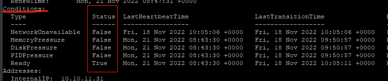
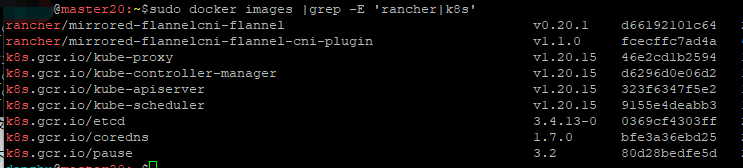

# K8S安装步骤和经验：主节点

## 一、环境准备：

### 机器环境
- 内存
Master: 至少2 Core和4G内存
Node：至少4 Core和16G内存

- CPU
Master：2 core至少（要是1core必然安装失败）
Node：可以1 core

Linux操作系统 基于x86_64架构的各种Linux发行版本，Kernel版本要求在3.10及以上


### 调整时区
如果时间或者时区不对，最好还是调整一下。

```bash
# 设置系统时区为中国/上海
$ timedatectl set-timezone Asia/Shanghai
# 将当前的 UTC 时间写入硬件时钟
$ timedatectl set-local-rtc 0
# 重启依赖于系统时间的服务
$ systemctl restart rsyslog
$ systemctl restart crond
```

### 关闭防火墙
```bash
$ systemctl stop firewalld
$ systemctl disable firewalld 
```

### 关闭selinux
如果有的话：

```bash
$ setenforce 0 #临时关闭selinux
$ getenforce #查看selinux状态
$ sed -i 's/^ *SELINUX=enforcing/SELINUX=disabled/g' /etc/selinux/config
```
## 二、Master节点安装

### 1、 初始安装

编辑`install_k8s.sh`，根据实际情况修改。重点是`MASTER1_IP`,`NODE1_IP`,`MASTER1`和`NODE1`这四项。一定要根据实际情况修改。`POD_NETWORK`和`SERVICE_NETWORK`不建议修改，因为要和后面的flannel网络插件的默认值相匹配。这里写的就是默认值。
```ini
#需要安装的k8s的版本
KUBE_VERSION="1.20.15"
KUBE_VERSION2=$(echo $KUBE_VERSION |awk -F. '{print $2}')

#master和node1节点的IP
MASTER1_IP=192.168.99.20
NODE1_IP=192.168.99.21

#master和node1节点的主机名
MASTER1=master20
NODE1=node201

POD_NETWORK="10.244.0.0/16"
SERVICE_NETWORK="10.96.0.0/12"
```
执行脚本，开始安装：

```bash
sudo ./install_k8s.sh
```

选择：`1) 初始化kubernetes集群`


这一步主要是做一些必须的环境设置和调整；设置docker拉取仓库地址，拉取必须的镜像等基础步骤。

如果一切正常，

### 2、安装网络插件flannel
```bash
wget https://raw.githubusercontent.com/flannel-io/flannel/master/Documentation/kube-flannel.yml -O kube-flannel-io.yml
kubectl apply -f ./kube-flannel-io.yml
```
执行完后，查看各个pod的状态
```bash
$ kubectl get pod -A
NAMESPACE      NAME                              READY   STATUS     
kube-flannel   kube-flannel-ds-6lwm6             0/1     Init:0/2   0   
kube-system    coredns-7f89b7bc75-c6vkd          0/1     Pending    0    kube-system    coredns-7f89b7bc75-sp5ln          0/1     Pending    0   
kube-system    etcd-umaster                      1/1     Running    0   
kube-system    kube-apiserver-umaster            1/1     Running    0    kube-system    kube-controller-manager-umaster   1/1     Running    0   
kube-system    kube-proxy-rqc2l                  1/1     Running    0   
kube-system    kube-scheduler-umaster            1/1     Running    0   

```
这时候，最完美的状态，就是所有的pod的`STAUS`那里都是显示着`Running`。但往往刚装完的时候，这里的coredns和kube-flannel等相关的pod，状态都是异常的（pending等）！不必惊慌，喝杯茶继续等待就好，因为可能还在拉取镜像，需要一些时间。

等到 `kubectl get pod -A` 这样的状态，就代表一切正常了。


## 三、检查和调试的一些方法
如果一切顺利（上图状态），就不需要看这个小节了。只有上面的状态里出现了异常，才需要这部分。 

- 如果是在上面《 1、 初始安装》的某个步骤里出了错误，可以在`install_k8s.sh`里，根据具体哪一行出错，在它的前面，增加一句 `set -x`，打开shell的调试开关，这样能看到更多的出错信息。
- 如果是在上面《 1、 初始安装》的最后一步`kubeadm init`里出现了错误，可以修改第184行，把`--v=5`改为`--v=10`，以获得更丰富的输出信息。

更多的调试相关命令：
- 查看相关服务的状态：
```bash
$ systemctl status kubelet -l
$ systemctl status docker -l
$ systemctl status containerd -l
#或者倒序地查看相关服务的运行日志：
$ journalctl -ru kubelet 
$ journalctl -ru docker
$ journalctl -ru containerd
```


- 查看各节点的资源状况：`kubectl describe node NODE_NAME`，重点是看其中的`Conditions:`段。正常状态只有Ready这一行是`True`，其余行应该是`False`。

  如果不是这样，就要检查相应的资源是否充足了！



还可以用本命令查看分配给这个节点的资源是否合理。

     

- 查看某个pod的日志和信息：
  安装后系统无法正常工作，往往都是某个pod的工作状态有问题造成的。至于具体是什么问题，就需要更详细的pod日志，才能获取到解决方向了。获取某个pod日志的方法是，先输入`kubectl get pods -A`命令，根据返回的pod列表，获知出问题的pod名称和命名空间（namespace）。pod名称+命名空间，是获取pod日志的先决信息。

  获知这两项信息后，输入`kubectl logs POD_NAME  -n NAMESPACE`，就能获得这个pod的详细日志了；同理，也可以输入`kubectl describe pod POD_NAME  -n NAMESPACE`，也可以获知这个pod的具体描述。
  
  如下举例中，先用第一个命令中获得具体的pod名称和namespace信息，再执行kubelet log 获取日志：`kubectl logs kube-flannel-ds-6lwm6 -n kube-flannel`。同理，还可以执行另外一条格式相似的describe命令，也可以查看pod的信息：`kubectl describe pod kube-flannel-ds-478nr  -n kube-flannel`
    
  
- 查看必须的镜像是否都已经成功拉取到本地。执行`sudo docker images |grep -E 'rancher|k8s'`，应该能看到如下的镜像列表（共9个）。
    

  如果缺少了哪个，就需要手工执行一下相应的 `docker pull image_name:image_ver` 命令拉取了。而往往这些镜像之所以缺少，就是国内无法直接拉取到，所以用docker pull也没法拉取。这时候就有可能需要先从国内拉取，然后再执行 docker tag 命令，修改为自己需要的tag名字。
  
  如果缺失了`rancher`开头的两个镜像，可以执行如下命令，通过我们提前准备好的tar包，重新导入获取镜像。

```bash  
$ wget http://47.103.140.181/download/flannel/cni-flannel.tar -O cni-flannel.tar
$ wget http://47.103.140.181/download/flannel/plugin-flannel.tar -O plugin-flannel.tar
$ sudo docker load < ./cni-flannel.tar
$ sudo docker load < ./plugin-flannel.tar
```

- 其他
```bash
$ tail /var/log/messages 
$ tail /var/log/dmesg
```
