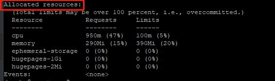
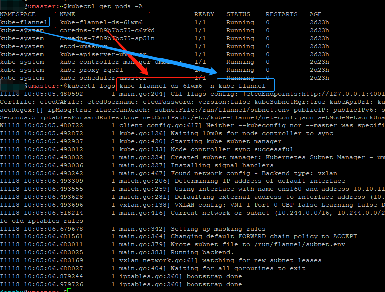

环境：

master: 

node1: 

## 环境准备：

### 调整时区
如果时间或者时区不对，最好还是调整一下。

```bash
# 设置系统时区为中国/上海
$ timedatectl set-timezone Asia/Shanghai
# 将当前的 UTC 时间写入硬件时钟
$ timedatectl set-local-rtc 0
# 重启依赖于系统时间的服务
$ systemctl restart rsyslog
$ systemctl restart crond
```

## Master节点安装

### 1、 初始安装

编辑`install_k8s.sh`，根据自己实际情况修改：
```ini
#需要安装的k8s的版本
KUBE_VERSION="1.20.15"
KUBE_VERSION2=$(echo $KUBE_VERSION |awk -F. '{print $2}')

#master和node1节点的IP
MASTER1_IP=192.168.99.20
NODE1_IP=192.168.99.21

#master和node1节点的主机名
MASTER1=master20
NODE1=node201

POD_NETWORK="10.244.0.0/16"
SERVICE_NETWORK="10.96.0.0/12"
```
执行脚本，开始安装：

```bash
sudo ./install_k8s.sh
```

选择：`1) 初始化kubernetes集群`


这一步主要是做一些必须的环境设置和调整；设置docker拉取仓库地址，拉取必须的镜像等基础步骤。

### 2、安装网络插件flannel
```bash
wget https://raw.githubusercontent.com/flannel-io/flannel/master/Documentation/kube-flannel.yml -O kube-flannel-io.yml
kubectl apply -f ./kube-flannel-io.yml
```
执行完后，查看各个pod的状态
```bash
$ kubectl get pod -A
NAMESPACE      NAME                              READY   STATUS     
kube-flannel   kube-flannel-ds-6lwm6             0/1     Init:0/2   0   
kube-system    coredns-7f89b7bc75-c6vkd          0/1     Pending    0    kube-system    coredns-7f89b7bc75-sp5ln          0/1     Pending    0   
kube-system    etcd-umaster                      1/1     Running    0   
kube-system    kube-apiserver-umaster            1/1     Running    0    kube-system    kube-controller-manager-umaster   1/1     Running    0   
kube-system    kube-proxy-rqc2l                  1/1     Running    0   
kube-system    kube-scheduler-umaster            1/1     Running    0   

```
这时候，最完美的状态，就是所有的pod，`STAUS`那里都是显示着`Running`。但往往，这里的coredns和kube-flannel相关的pod，都是异常的！这时不必惊慌，喝杯茶继续等待就好，因为可能镜像拉取比较慢，需要一些时间。

等到 `kubectl get pod -A` 这样的状态，就代表一切正常了。


### 3、安装调试
如果一切顺利（上图状态），就不需要看这个小节了。只有上面的状态里出现了异常，才需要这部分。 

- 如果是在上面《 1、 初始安装》的某个步骤里出了错误，可以在`install_k8s.sh`里，根据具体哪一行出错，在它的前面，增加一句 `set -x`，打开shell的调试开关，这样能看到更多的出错信息。
- 如果是在上面《 1、 初始安装》的最后一步`kubeadm init`里出现了错误，可以修改第184行，把`--v=5`改为`--v=10`，以获得更丰富的输出信息。
- 如果是在上面《2、安装网络插件flannel》里碰到了问题，可以

更多的调试相关命令：
- 查看相关服务的状态：
```bash
$ systemctl status kubelet 
$ systemctl status docker
$ systemctl status containerd
#或者：
$ journalctl -u [service_name]
```


- 查看各节点的资源状况：`kubectl describe node NODE_NAME`，重点是看其中的`Conditions:`段。正常状态是只有Ready这一行是`True`，其余应该是`False`。如果不是这样，就要检查相应的资源是否充足了。  


还可以查看分配给这个节点的资源，看是否合理。

     

- 查看某个pod的日志：`kubectl logs POD_NAME  -n NAMESPACE`
如查看` kube-flannel`相关pod的日志：先输入`kubectl get pods -A`，再根据返回内容，输入`kubectl logs kube-flannel-ds-6lwm6 -n kube-flannel`。
  

- 其他
```bash
$ tail /var/log/messages 
$ tail /var/log/dmesg
```
