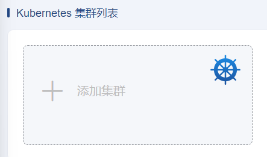
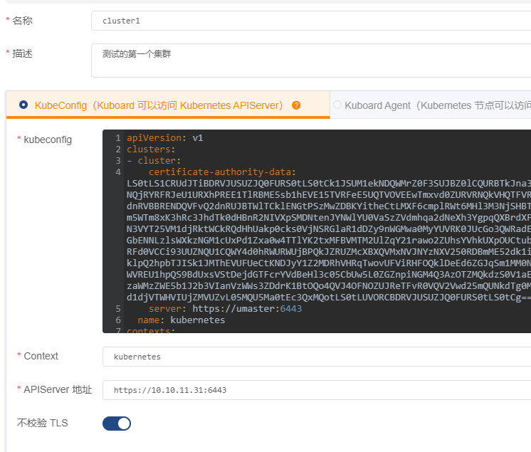
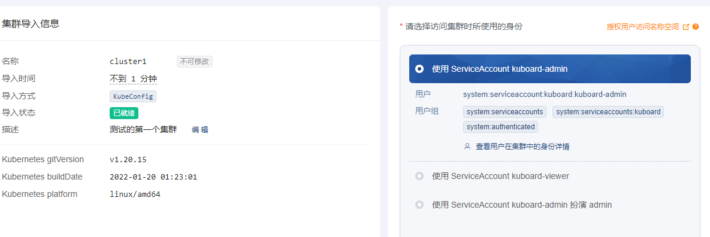

# Kuboard的安装

个人建议安装完Master节点之后，就可以安装Kuboard管理平台了。这样可以帮助后续的问题定位，使用起来更方便一些。

具体的安装方式见官方：https://kuboard.cn/install/v3/install-built-in.html 

官方给出的命令行里，其实主要就一个参数需要配置，就是这个`内网IP`。我也不懂为啥特别要强调这是“内网”IP，实际上输入执行这行命令的机器真实网卡IP就行。这台机器不需要是Master或Worker节点，就是独立的一台机器。只要它能访问得到Master的`6443`端口就可以，当然非要装在Master或者Worker节点上也不是不行。

```bash
$ sudo docker run -d \
  --restart=unless-stopped \
  --name=kuboard \
  -p 80:80/tcp \
  -p 10081:10081/tcp \
  -e KUBOARD_ENDPOINT="http://内网IP:80" \
  -e KUBOARD_AGENT_SERVER_TCP_PORT="10081" \
  -v /root/kuboard-data:/data \
  eipwork/kuboard:v3
```

所以实际的命令行可能长这样：
```bash
$ sudo docker run -d \
  --restart=unless-stopped \
  --name=kuboard \
  -p 8080:80/tcp \
  -p 10081:10081/tcp \
  -e KUBOARD_ENDPOINT="http://10.10.11.31:8080" \
  -e KUBOARD_AGENT_SERVER_TCP_PORT="10081" \
  -v /root/kuboard-data:/data \
  eipwork/kuboard:v3
```

安装好后，根据IP和端口访问 http://10.10.11.31:8080 默认用户名/密码：admin/Kuboard123。

为了以后使用更方便，可以给上面的命令做一个别名。编辑 /etc/bash.bashrc：
```bash
alias kuboard='docker run -d \
  --restart=unless-stopped \
  --name=kuboard \
  -p 8080:80/tcp \
  -p 10081:10081/tcp \
  -e KUBOARD_ENDPOINT="http://10.10.11.31:8080" \
  -e KUBOARD_AGENT_SERVER_TCP_PORT="10081" \
  -v /root/kuboard-data:/data \
  eipwork/kuboard:v3'
```
日常启停：
```bash
$ docker stop  kuboard 
$ docker start kuboard 
```

安装完成后，就需要进行配置，才能对具体的Cluster具有管理功能。

登陆后，选择添加集群：



环境比较简单的话，就用直接复制 .kubeconfig 即可，不需要安装agent。把从Master节点上的 ~/.kube/config 内容复制黏贴过来即可。其他“名称”和“描述”等，就根据需要填写吧。需要稍微注意的是 APIServer 地址，最好直接写IP，不要写名称（如master等名）。



然后选择使用的身份：



就可以对这个集群Cluster1进行完整的管理了。