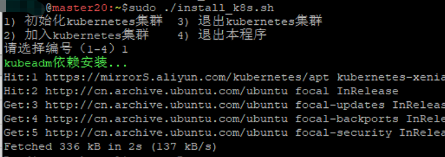

# K8S安装步骤：工作节点（Worker）

请先参考《K8S安装步骤和经验：主节点》篇，那里面的“环境准备”步骤，这部分也是需要一样执行一遍，就不再赘述了。

### 1、 初始安装

编辑`install_k8s.sh`，根据实际情况修改。重点是`MASTER1_IP`,`NODE1_IP`,`MASTER1`和`NODE1`这四项。一定要根据实际情况修改。`POD_NETWORK`和`SERVICE_NETWORK`不建议修改，因为要和后面的flannel网络插件的默认值相匹配。这里写的就是默认值。

```ini
#需要安装的k8s的版本
KUBE_VERSION="1.20.15"
KUBE_VERSION2=$(echo $KUBE_VERSION |awk -F. '{print $2}')

#master和node1节点的IP
MASTER1_IP=192.168.99.20
NODE1_IP=192.168.99.21

#master和node1节点的主机名
MASTER1=master
NODE1=node1

POD_NETWORK="10.244.0.0/16"
SERVICE_NETWORK="10.96.0.0/12"
```

执行脚本，开始安装：

```bash
sudo ./install_k8s.sh
```

选择：`2) 加入kubernetes集群`



这一步主要是做一些必须的环境设置和调整；设置docker拉取仓库地址，拉取必须的镜像等基础步骤。

如果一切正常，

### 

kubeadm config images list

kubeadm token create --print-join-command

还要在最后加上 “ --cri-socket unix:///var/run/cri-dockerd.sock”


把Master节点的 `/etc/cni/net.d/10-flannel.conflist`，复制到Node节点  `/etc/cni/net.d/10-flannel.conflist`。


/run/flannel/subnet.env

sudo kubeadm join 10.10.11.31:6443 --token 42u7ir.hh2ihtt2p0c72389     --discovery-token-ca-cert-hash sha256:2c41b128f8d55ed28a208f855cb03a9d1dae22a28a1c2fb3f84d11b8f2b71c16  --cri-socket unix:///var/run/cri-dockerd.sock --v=10

journalctl -xe

