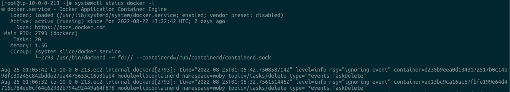
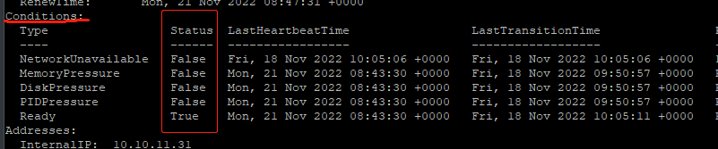
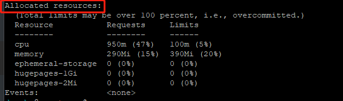
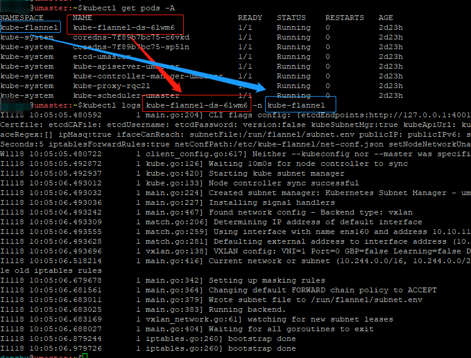
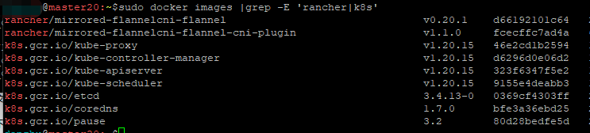

# K8S安装和调试

如果一切顺利（上图状态），就不需要看这个小节了。只有安装过程中出现了异常，才需要看这部分 —— 当然k8s的安装嘛，出现异常才是常态。 

### 1、调试`install_k8s.sh`脚本

如果是在运行这个脚本的“ 初始安装”期间，发现某个步骤出了错误，可以在`install_k8s.sh`里，根据具体情况，在合适的位置，增加一句 `set -x`，打开shell的调试开关，这样能看到更多的出错信息。

如果是`install_k8s.sh`脚本运行的的最后一步`kubeadm init`里出现了错误，可以修改第184行，把`--v=5`改为`--v=10`，以获得更丰富的输出信息。

### 2、各相关服务的状态和日志

查看相关服务的状态：
```bash
$ systemctl status kubelet -l
$ systemctl status docker -l
$ systemctl status containerd -l

#或者倒序地查看相关服务的运行日志：
$ journalctl -ru kubelet 
$ journalctl -ru docker
$ journalctl -ru containerd
```


### 3、查看节点状态

需要先列出各节点：`kubectl get nodes -A`

看看节点是否都在Ready状态：

正常应该是这样的：
```bash
$ kubectl get nodes -A
NAME      STATUS                     ROLES                  AGE     VERSION
node1     Ready,SchedulingDisabled   <none>                 3d22h   v1.20.15
umaster   Ready                      control-plane,master   6d23h   v1.20.15
```

可以看到上面两个节点`umaster`和`node1`。umaster是完全正常的状态，node1是暂时被禁用状态。

在上一命令的基础上，接着查看各节点的资源详情：`kubectl describe node NODE_NAME`。

最后一个参数就是节点名称，就是上一个命令里看到的第一列的名字。所以如果看主节点，就要输入`kubectl describe node umaster`。最后一个参数是和前面安装时指定的各节点名称有关系的。 这个命令的返回内容里，重点是看其中的`Conditions:`段。正常状态只有Ready这一行是`True`，其余行应该是`False`。如果不是这样，就要检查相应的资源是否充足了！  



还可以在这个命令的返回内容里，查看分配给这个节点的资源是否合理。  

     

### 4、查看某个pod的状态

安装后系统无法正常工作，往往都是某个pod的工作状态有问题造成的。至于具体是什么问题，就需要更详细的pod日志，才能获取到解决方向了。

获取某个pod日志的方法是，先输入`kubectl get pods -A`命令，根据返回的所有pod列表，获知出问题的pod名称和命名空间（namespace）。pod名称+命名空间，是获取pod日志的先决信息。

获知这两项信息后，输入`kubectl logs POD_NAME  -n NAMESPACE`，就能获得这个pod的详细日志了；同理，也可以输入`kubectl describe pod POD_NAME  -n NAMESPACE`，也可以获知这个pod的具体描述。

如下举例中，先用第一个命令中获得具体的pod名称和namespace信息，再执行kubelet log 获取日志：`kubectl logs kube-flannel-ds-6lwm6 -n kube-flannel`。同理，还可以执行另外一条格式相似的describe命令，也可以查看pod的信息：`kubectl describe pod kube-flannel-ds-478nr  -n kube-flannel`
  

### 5、查看必须的镜像

查看必须的镜像是否都已经成功拉取到本地。执行`sudo docker images |grep -E 'rancher|k8s'`，应该能看到如下的镜像列表（共9个）。
    

如果缺少了哪个，就需要手工执行一下相应的 `docker pull image_name:image_ver` 命令拉取了。而往往这些镜像之所以缺少，是因为国内无法直接拉取到，所以用docker pull也没法拉取。这时候就有可能需要先从国内拉取，然后再执行 docker tag 命令，修改为自己需要的tag名字。

如果缺失了`rancher`开头的两个镜像，可以执行如下命令，通过我们提前准备好的tar包，重新导入获取镜像。

```bash  
$ wget http://47.103.140.181/download/flannel/cni-flannel.tar -O cni-flannel.tar
$ wget http://47.103.140.181/download/flannel/plugin-flannel.tar -O plugin-flannel.tar
$ sudo docker load < ./cni-flannel.tar
$ sudo docker load < ./plugin-flannel.tar
```

### 6、其他

系统信息等：

```bash
$ tail /var/log/messages 
$ tail /var/log/dmesg
```
