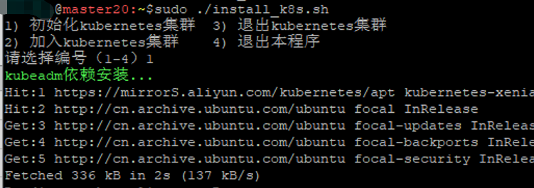

环境：

master: 

node1: 

## Master节点安装

### Step1 初始安装

编辑`install_k8s.sh`，根据自己实际情况修改：
```ini
#需要安装的k8s的版本
KUBE_VERSION="1.20.15"
KUBE_VERSION2=$(echo $KUBE_VERSION |awk -F. '{print $2}')

#master和node1节点的IP
MASTER1_IP=192.168.99.20
NODE1_IP=192.168.99.21

#master和node1节点的主机名
MASTER1=master20
NODE1=node201

POD_NETWORK="10.244.0.0/16"
SERVICE_NETWORK="10.96.0.0/12"
```
执行脚本，开始安装：

```bash
sudo ./install_k8s.sh
```

选择：`1) 初始化kubernetes集群`



这一步主要是做一些必须的环境设置和调整；设置docker拉取仓库地址，拉取必须的镜像等基础步骤。

### 安装网络插件flannel
```bash
wget https://raw.githubusercontent.com/flannel-io/flannel/master/Documentation/kube-flannel.yml -O kube-flannel-io.yml
kubectl apply -f ./kube-flannel-io.yml
```
执行完后，查看各个pod的状态
```bash
$ kubectl get pod -A
NAMESPACE      NAME                              READY   STATUS     
kube-flannel   kube-flannel-ds-6lwm6             0/1     Init:0/2   0   
kube-system    coredns-7f89b7bc75-c6vkd          0/1     Pending    0    kube-system    coredns-7f89b7bc75-sp5ln          0/1     Pending    0   
kube-system    etcd-umaster                      1/1     Running    0   
kube-system    kube-apiserver-umaster            1/1     Running    0    kube-system    kube-controller-manager-umaster   1/1     Running    0   
kube-system    kube-proxy-rqc2l                  1/1     Running    0   
kube-system    kube-scheduler-umaster            1/1     Running    0   

```
这时候，最完美的状态，就是所有的pod，`STAUS`那里都是显示着`Running`。但往往，这里的coredns和kube-flannel相关的pod，都是异常的！这时不必惊慌，继续等待就好。


```
fs.inotify.max_user_watches = 1048576
```